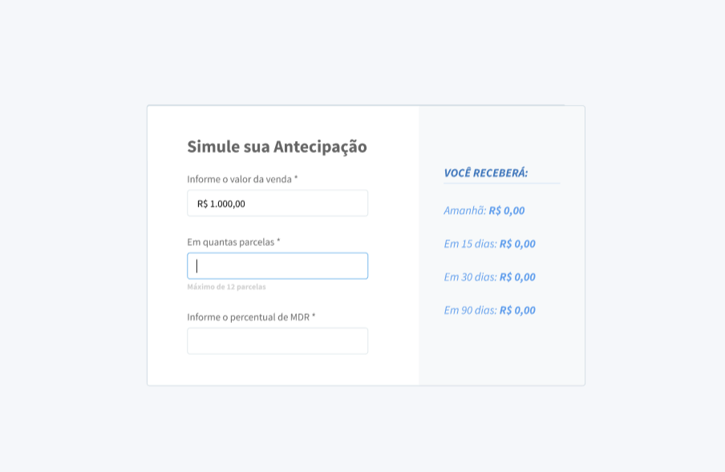

# Documentação Projeto Antecipation

## Tabela de Conteúdos

- [Documentação Projeto Antecipation](#documentação-projeto-antecipation)

  - [Tabela de Conteúdos](#tabela-de-conteúdos)
  - [1. Visão Geral](#1-visão-geral)
  - [2. Layout](#2-layout)
  - [3. Início Rápido](#3-início-rápido)
    - [3.1. Instalando Dependências](#31-instalando-dependências)
    - [3.2. Variáveis de Ambiente](#32-variáveis-de-ambiente)
  - [4. Sobre a Api](#4-sobre-a-api)

---

## 1. Visão Geral

Visão geral do projeto, um pouco das tecnologias usadas.

Hoje nossos clientes precisam saber quanto custa antecipar uma transação, e para isso, precisamos desenvolver uma calculadora de antecipação para que os mesmos consigam saber quais valores receberão caso optem por antecipar o recebimento.

Foi utilizado no projeto as seguintes Tecnologias:

- [React]
- [Axios]
- [useForm]
- [Yup]
- [React-Router-Dom]
- [Toastify]

---

## 2. Layout

Layout do projeto:

## 

## 3. Início Rápido

[ Voltar para o topo ](#tabela-de-conteúdos)

### 3.1. Instalando Dependências

Clone o projeto em sua máquina e instale as dependências com o comando:

```shell
yarn
```

### 3.2. Variáveis de Ambiente

Rodo o comando para rodar o projeto em sua máquina local:

```
yarn start
```

---

## 4. Sobre a Api

Para mais informações sobre o teste e sobre a api clique no link:
https://github.com/hashlab/hiring/blob/master/challenges/pt-br/front-challenge.md
